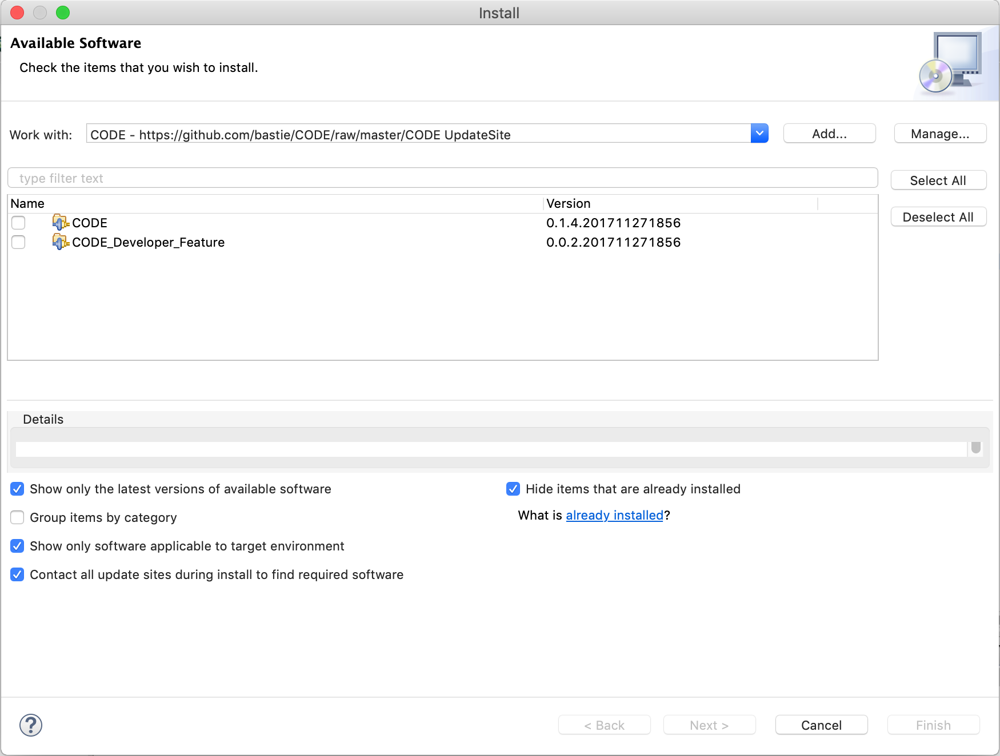

# CODE
COBOL Development Environment

## FAQ
### How to install
#### Install GnuCOBOL
##### MacOS
1. Take the simple way. Install homebrew with `/usr/bin/ruby -e "$(curl -fsSL https://raw.githubusercontent.com/Homebrew/install/master/install)"`. 
2. Now download and build GnuCOBOL with `brew install gnu-cobol`. 
3. Download your Eclipse IDE https://www.eclipse.org/downloads/eclipse-packages/
4. Download CODE repository from https://github.com/IntegralWorks/CODE/archive/master.zip and extract this.
5. Select `Install New Software` (Help Menu), add the `CODE UpdateSite` directory from extracted CODE repository (deselect catagory) accept license and test the new COBOL Eclipse features. 

##### Linux (from source)
1. Download sources from GnuCOBOL with `wget https://downloads.sourceforge.net/project/open-cobol/gnu-cobol/3.0/gnucobol-3.0-rc1.tar.xz`
2. Install Berkeley DB, ncurses and GMP for developing; for example `rpm -Uvh gmp-devel-6.0.0-15.el7.x86_64.rpm libdb-devel-5.3.21-24.el7.x86_64.rpm ncurses-devel-5.9-14.20130511.el7_4.x86_64.rpm`
3. Now build GnuCOBOL with `./configure && make && make check && sudo make install`.
4. Download your Eclipse IDE https://www.eclipse.org/downloads/eclipse-packages/
5. Download CODE repository from https://github.com/IntegralWorks/CODE/archive/master.zip and extract this.
6. Select `Install New Software` (Help Menu), add the `CODE UpdateSite` directory from extracted CODE repository (deselect catagory) accept license and test the new COBOL Eclipse features. 

#### Install CODE
##### Online
1. Use ´https://github.com/IntegralWorks/CODE/raw/master/CODE UpdateSite´ as Update Site URL
(Deselect category)

##### Offline
1. Download CODE repository from https://github.com/IntegralWorks/CODE/archive/master.zip and extract this.
2. Select `Install New Software` (Help Menu), add the `CODE UpdateSite` directory from extracted CODE 

